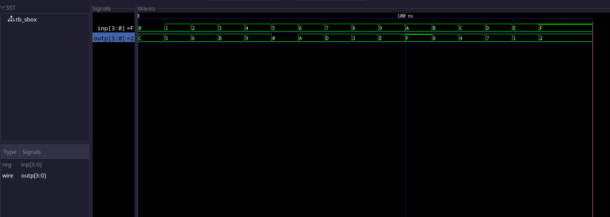

## Solution for Assignment 1-A

- Implemented `sbox.v` using an always block, by creating a sensitivity list for all the boolean equations.
- TestBench implemented using the truth table given in the assignment.
- Timing diagram attached below.

