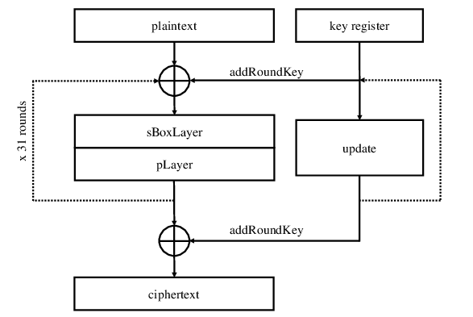
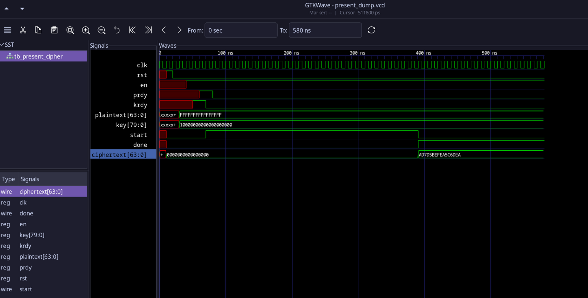

## Solution for Assignment-B

### Understand PRESENT Cipher

To solve the assignment, we first need to understand how the cipher functions.

Each Cryptosystem needs to have 3 key layers, AddKey or AddRoundKey, ConfusionLayer(to hide the relation between the ct and key) and a DiffusionLayer(to hide the relation between ct and pt).

Since in the last assignment, i implemented the sbox(ConfusionLayer) using continuous assignment in verilog, i now need to implement the

- KeySchedule -> responsible for round keys
- PermutationLayer -> responsible for the DiffusionLayer

### Overview of PRESENT

#### KeySchedule

Here, we can see that the first operation that happens in the cipher, is with the plaintext and the round key, hence going chronologically, we can first design the keyscheduler, which is responsible for generating 32keys, 1 for each round.

How it works:

- The 80bit(why 80 bit? because the assignment says so, it can also be 128) master key is fed into a 80-bit register, let's say K = k79, k78, ... , k0{kxx represents the bits}.
- Now, for each round, the roundKey would be the top 64 bits of the register, K_round = k79, k78, ... , k16.
- After the current round key is used, it is updated, by 3 operations.
- OP1 -> ROTL by 61 => K = K <<< 61
- OP2 -> The top 4 bits are substituted with its Sbox equivalent, therefore, k79,k78,k77,k76 = S[k79,k78,k77,k76]
- OP3 -> XOR roundCounter, What is the roundCounter? The roundCounter is just counting the rounds from 1 to 31(5 bit binary number).
- OP3 -> XOR roundCounter, [k19,k18,k17,k16 ^= round_counter], where round_counter varies from [00000,11111]

After the keyscheduler, the 64bit state is split into 4 bits each, that is 16 nibbles, and then the Sbox is applied to each nibble parallelly.

#### PLayer

This layer is just a DiffusionLayer, meaning the entire purpose of this layer is to make it harder to reverse the states.

In verilog, since this is just logic rewiring and designing, this takes close to 0 compute.

How it works:

- Let my bit position be i, now to diffuse it, a formula is applied, P(i) = (i×16) mod 63 for i != 63, where P(i) is the diffused output.
- So bit 0 -> 0, bit 1 -> bit 16, bit 4 -> bit 1 and so on.

Below is the timing diagram for the entire cipher.

