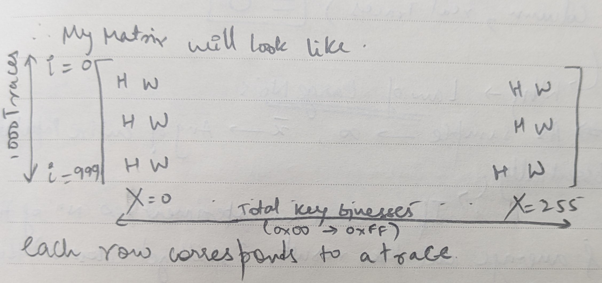
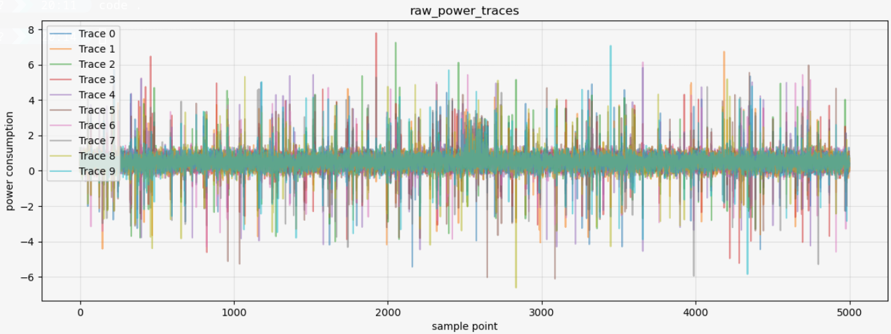
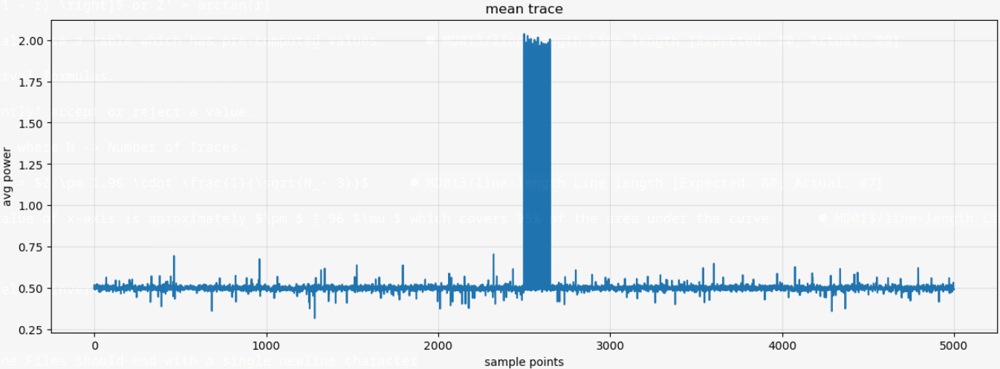

# Solution for Assignment 2

## Problem Statement-> Perform Correlation Power Analysis (CPA) attack on AES implementation to recover the secret key

Since I did not have access to the traces, I generated a script from an LLM(claude) to simulate the traces, as per requirement given in the assignment.

### What is CPA?

Correlational Power Analysis, a type or an advanced form of DPA, Why is it used? Since it builds a better model of the device, and it is more efficient with the number of traces required to recover the key.

Understanding the Power Model:

In a power trace, each point on the trace can be modelled as -> `P_total = P_op + P_data + P_el.noise + P_const`, where all these dividends of P_total are a function of time. Although here, P_const is not of much use, since it is mostly constant with each trace.

P_op -> This is the power consumption that depends on the operation being processed.
P_data -> This is the power consumption that depends on the data being processed.

Since we are working with AES here, which is majorly data dependent(it is also operation dependent(P_op is more or less constant), but more of data).

The entire CPA model is based on the Hamming weight power model, where `0000` would consume less power than `1111`.

To eliminate P_el.noise, we need to first characterize it.

To characterize P_el.noise:

- Record traces of a device which is performing a FIXED operation on FIXED data.
- After repeating this multiple times, the observation is that the noise becomes somewhat like a normal distribution.
- The above phenomenon can also be classified as a result of the Central Limit Theorem.

Now, the only thing left to characterize is the most important function, P_data.

Lets say I have 1000 traces, now for AES, since each input is 8bits, my "Hypothesis Matrix" will be `[1000, 256]`, where 256 corresponds to `2^8`

Now, Lets make a Hypothesis i.e. -> for what my key byte will be (X), where X is my guess byte. I need to guess `HW[Sbox[Pt(i)(byte) ^ X]]`, where i is my index and byte is the byte of the key(0th byte, 1st byte etc) I want.

My correct guess will correspond to the column, not JUST the element, since all elements in the column will be aligned with each other.

### Why does CPA work, Statistically?

If i have $\infty$ traces -> Correlational Coefficient = 0, but only for the incorrect guess.

Why? -> Law of Large Numbers.

- As a sample tend to $\infty$, spurious correlations between wrong key guesses and actual power traces average out to 0.
- For the correct guess, the correlation tends to a nonzero value (ideally $\pm$ 1 under a perfect power model), since the hypothesis is aligned with the actual leakage.
- Therefore, the more the traces, the easier it is to distinguish the correct guess from the noise floor of wrong guesses.
- Mathematical formula is below.

$\frac{1}{N} \sum_{i=1}^{N} X_i \xrightarrow{N \to \infty} \mathbb{E}[X]$

Now, if i have $\infty$ traces, it will be extremely easy to detect an incorrect guess, since the chances of a spurious correlation is extremely small. Therefore, the more the traces, the better.

Confidence Intervals -> What and Why?

Lets say r = pearson coeff. & `r = 0.08` & we are NOT aware of the "Order of CPA", how would we figure out if its the correct guess or not?

Firstly, we need to set some ground rules, since we cannot directly use r as r $\in$ [-1, 1], where we cannot determine or guarantee the symmetry of the distribution.

To normally distribute Pearson's r, Fisher's Z-Transform is utilized.

$Z' = \frac{1}{2} \left[ \ln(1 + r) - \ln(1 - r) \right]$ or Z' = arctanh(r)

Instead of computing these values, we can also use a table which has pre-computed values.

Now, we can apply standard Confidence Interval formulas.

With Confidence Intervals, we can "confidently" accept or reject a value.

Standard Error = $\frac{1}{\sqrt{N - 3}}$ , where N -> Number of Traces.

Now, in the Z space, Z(Confidence Interval) = $Z \pm 1.96 \cdot \frac{1}{\sqrt{N - 3}}$

Why 1.96, since in the standard normal curve, the value of x-axis is aproximately $\pm $ 1.96 $ \mu $ (standard deviation) which covers 95% of the area under the curve.

To get Correlational Value -> r = tanh(Z).

For a key match, Interval > 0, if < 0, model is inverted as H.W. > 0.

### Assignment Solving Approach

By looking at the raw traces, we cannot really figure out much, since the signal is very weak and there is a lot of noise.

So to reduce noise, I plotted a mean plot, since noise is normally distributed and mean traces would reduce the noise.

Here, we can see that there is some operation going on in the interval of [2000,3000] sample points, which has to be AES.

I also plotted the variance but the results are same as the mean plot.

Now, since we know the range, we can directly start operating on it.

First step is to compute the Hamming Weight of all the 256 byte values at once, so we do not need to compute it once we are in the Hypothesis Matrix

After that we need to implement the Hypothesis Matrix.

The most important part of the entire attack is the correlation a.k.a Pearson's Correlational Coefficient

$r = \frac{\sum (X - \bar{X})(Y - \bar{Y})}{N \cdot \sigma_X \cdot \sigma_Y}$

The numerator is the formula for Covariance(X,Y), where X -> hypothesis, i.e. predicted leakage and Y -> traces, i.e. actual power.

Centering here means that I am subtracting mean from the original signal, which corresponds to -> $(X - \bar{X}) $

`corr = hypothesis_centered.T @ traces_centered`

This line in the code is just doing a matrix Transpose of hypothesis_centered and then matrix multiplying it with traces_centered.

Why? -> (256, num_traces) @ (num_traces, num_points) => This multiplication give me (256, num_points) as the final matrix, which is exactly what my numerator should be.

After computing that, we can just check for the highest `r` since this is most likely a 1st order attack.

Doing this gives me the key.
