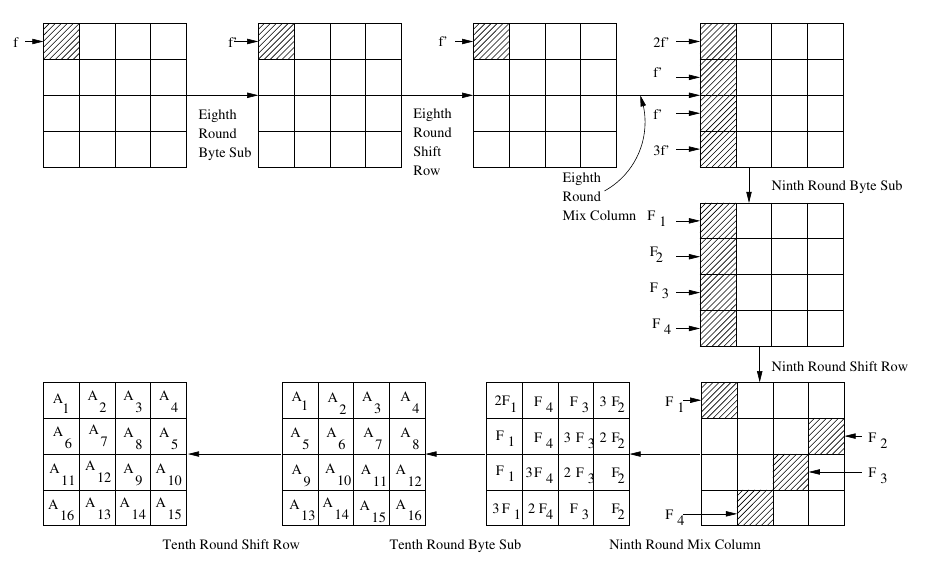

# Solution for Assignment 3

## Problem Statement -> Perform Statistical Fault attack on AES implementation to recover a byte of the last round key

Since I did not have access to the traces, I generated a script from an LLM(claude) to simulate the traces, as per requirement given in the assignment.

### What are Fault Attacks?

Fault Injection Attacks are a physical security issue, where in an attacker will try to induce faults/errors into the compute device, such that the device starts to act abnormally, causing the device to ultimately malfunction which is beneficial to the attacker. There are mainly 4 types of FIAs:

- Clock based -> For this to work, the target device should have an external clock, if there is a PLL(Phase Locked Loop), then this attack cannot be performed.
- Voltage based -> Mux and Crowbar attacks, Mux attacks switches between 2 voltage sources, Crowbar attack makes the voltage close to the transistor limit, as close to the limit which makes the transistor turn on.
- Laser based -> Highly precise, focussed laser pulses are used to induce faults.
- EM based -> EM pulses used to induce faults, no physical contact.

Understanding the Fault Models:

Since there are multiple ways to fault a device, we need to classify them and build a general model as to what part needs to be faulted and how. That is where fault models come into the picture.

#### Random Localized Faults

This is the most common and general fault model, which makes the basis for Differential Fault Analysis.
Here, once the faults are injected during computation, the faulty outputs are compared against the correct ciphertexts, and the differences can be used to recover the key.

The best place to inject a fault here(AES) would be to inject it in the last rounds(8th, 9th rounds for AES-128), since there is not going to be a MixColumns operation in the next round, drastically reducing the diffusion, as now only 4 bytes of the ciphertext are going to be affected, in predictable diagonal patterns.

All the math here is in GF($2^8$) where the irreducible polynomial is $x^8 + x^4 + x^3 + x + 1$



This image above clearly shows us that when a fault is induced in the state matrix in later rounds, we can exactly trace where the byte is going.
Like in the image above, let the faulted byte be f, now:

- Round 8 SubBytes -> After Sbox[f], let the value obtained be some `f'`, which is a non-zero value, since S-box is a bijection (one-to-one mapping), so a non-zero input difference guarantees a non-zero output difference.

- Round 8 ShiftRows -> Pure byte permutation, no change to the difference value. `f'` just moves to a different position in the state.

- Round 8 MixColumns -> This is where the fault spreads. MixColumns operates column by column using the matrix M. Since f' sits in row 0 of its column (from the image), the entire column difference becomes `(2f', f', f', 3f')`, which if observed once, are just the entries of the first row of M, each scaled by f'. The other three columns remain unaffected, difference = 0.

- Round 9 SubBytes -> After Sbox is applied,the differences no longer exists so we denote as new variables now, `F1, F2, F3, F4` in the image.

- Round 9 ShiftRows -> Shifts row i by i positions, which scatters `F1, F2, F3, F4` into 4 different columns

- Round 9 MixColumns -> This operation makes sure that all 4 fault-affected bytes are in different rows, which we can see in the image.

- Round 10 operations -> Carry out just like the other rounds, except MixColumns. The difference propagates through this round and we can see `CT XOR CT'`

Round 10 SubBytes, ShiftRows, AddRoundKey(K10) -> These are applied identically to both correct and faulty runs. The differences propagate through and are what you finally observe as CT ⊕ CT'.

For the above logic, we can get out differential equations for each byte, and then we can compute the solutions for it in finite field. Since there are $2^8$ possible values for 1 byte, and we have 4 faulted bytes, our key hypothesis space is reduced to $2^32$, which can be bruteforced!

We can even reduce our space to $2^8$ by improving fault injection in 8th round.

#### Instruction skip/modify

This is also a similar fault model like the previous one, but here we induce faults in instruction opcodes to either modify them or skip them.

This can be done on an ARMv7 processor or any TDMI marked ARM processor, where Thumb instructions can be utilised.

The model for faulting here is to fault at the Thumb instructions, which are only 16(or 32, depending on what type) bits, where, if the hamming distance is around 1-2, then inducing faults is a very practical model.

Instructions corresponding to Load and Store(`LDR`, `STR`, `LDMIA`, `STMIA`) provide a good attack surface to get started with attacking, since they directly interact with data.

`LDMIA r1!,{r3-r10}`: 11101000101100010000011111111000
`LDMIA r1!,{r3-r10,PC}`: 1110100010110001 $\underline{1}$ 000011111111000

Flipping that one bit can cause major faults.

### Assignment solving approach

```
[*] AES key        : 2719ed9f47a20579e1d10cce5c3621a3
[*] Number of traces: 200
[*] Last round key : 21c8214f0a0cc4c6a86780303f691f1f
[*] Key byte 0 (answer): 0x21
[*] Written 200 faulty ciphertexts to 'fault_ciphertexts.txt'
[*] Last line of file is the correct key byte: 0x21
```

We need to perform SFA(Statistical Fault Analysis) to recover one byte of the last round.

But first we need to understand how SFA.

The idea is that biased fault injection makes the intermediate state statistically non-uniform, and this non-uniformity is only visible when you decrypt with the correct key guess. Wrong keys scramble the structure away via inv_sbox.

What is the bias here? Since only a single random bit flip is at byte 0, our space is only limited to the 8 possible 1 bit flips of byte0.

CT[0] = Sbox(v XOR $2^i$ ) XOR K10[0], where v is the true unfaulted byte and  $i \in [0,7]$ is the flipped bit.

Also unlike DFA, SFA only requires faulty ciphertexts, so no correct ciphertext needed.

Now, since we have the fault attack set up, all we need is a scoring metric, because we do not have anything else to compare the faulty ciphertexts against.

To quantify this bias for each key guess, we use an SEI metric. I am using a pairwise hamming weight SEI, because the only relation between single-bit neighbors is to XOR them and check for difference.

For each key guess $K_g$, we partially decrypt:
$$
S^{-1}(CT[0] \oplus K_g)
$$

We then measure how structured the resulting 8 intermediate values are.  
For the correct key, this structure is rigid and measurable; for wrong keys, it collapses.  

The key with the highest score is our answer.

For the correct key guess $K_g$, the 8 intermediates are exactly:
$$
\{ v \oplus 2^0, v \oplus 2^1, \ldots, v \oplus 2^7 \}
$$

For any two members $a = v \oplus 2^i$ and $b = v \oplus 2^j$, the $v$ cancels:
$$
a \oplus b = 2^i \oplus 2^j \;\;\implies\;\; \text{popcount}(a \oplus b) = 2
$$

All $\binom{8}{2} = 28$ pairwise XORs must have exactly 2 bits set.  
Wrong keys produce arbitrary intermediates and this property breaks immediately.

So the metric is:
$$
\text{SEI}_{\text{PHW}}(K_g) =
\#\left\{
(a,b)\ \middle|\
a \ne b,\
a,b \in \{ S^{-1}(c \oplus K_g) \},\
\text{popcount}(a \oplus b) = 2
\right\}
$$

The correct key scores $28/28$, while wrong keys score $\leq 9/28$.

The key byte is recovered as $\texttt{0x21}$, which matches the answer in the file.
